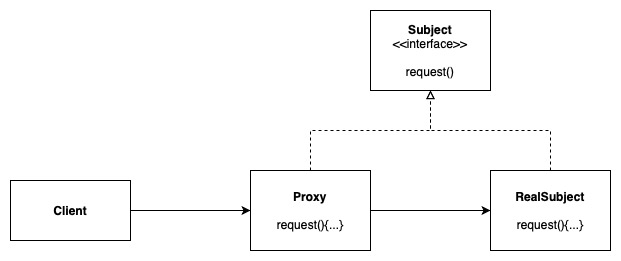
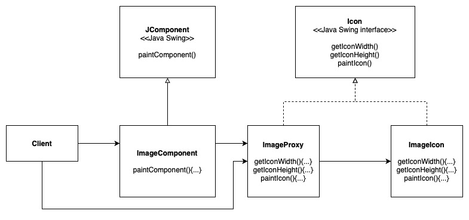
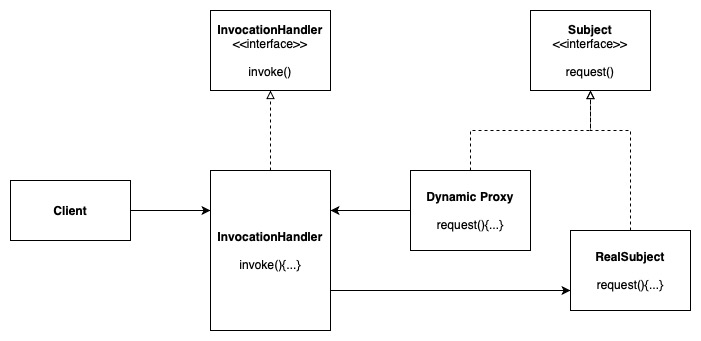

# Proxy Pattern

Provides a surrogate, or a placeholder for another object to control access to it.

There are three(3) types of Proxy:

1. Remote Proxy - to control access to a remote object

2. Virtual Proxy - to control access to a resource or object which is expensive to create.

3. Protection Proxy - controls access to a resource based on access rights.

Related Example: State Pattern

## Design Solution



### Example 1: Remote Gumball Machine Monitor (Remote Proxy)


How to run the example:

1. Run 3 terminals: Terminal A, Terminal B, Terminal C

2. In all terminals, navigate to `/src`

3. In Terminal A, run:

    ```
    rmiregistry
    ```

4. In terminal B, run:

    ```bash
    javac ProxyPattern/Example1/Machine2/RemoteGumballServerMain.java
    ``` 

    ```bash
    java ProxyPattern.Example1.Machine2.RemoteGumballServerMain localhost 15
    ```
   
4. In terminal C, run:

    ```bash
    javac ProxyPattern/Example1/Machine1/RemoteGumballMonitorClientMain.java
    ``` 

    ```bash
    java ProxyPattern.Example1.Machine1.RemoteGumballMonitorClientMain
    ```
   
SOME NOTES:

1. The two machines must have one SHARED interface (cannot be copied and pasted)

https://coderanch.com/t/483663/java/Stub-cast-Interface

"You cannot copy the interface to some other package without changing the package declaration. So what you need to do is to have a shared package between the server and the client which will share this interface. Even if you have the signature, methods and everything same the package declaration is different so there are 2 separate .class files for the interface with 2 different package declarations so you simply cannot cast it and make it work that way. You can export the interface in a jar to the client but still without changing the package declaration." Credit to Suhas Bilaye

Other issues on RMI:

https://stackoverflow.com/questions/464687/running-rmi-server-classnotfound


### Example 2: CD Image (Virtual Proxy)



### Example 3: Hot or Not (Protection Proxy with Invocation Handler aka Dynamic Proxy)

High Level Solution:


Detailed Solution:



Example 3 Solution:


The Dynamic Proxy is being created Dynamically behind the scenes, when Client calls the `newProxyInstance()` method. Invocation Handlers are the middlemen/filter that Client deals with, in order to get to the proxy.

# Other Examples

[Example in NodeJS](https://github.com/asyrul21/design-patterns-nodejs/tree/master/structural/proxy)


