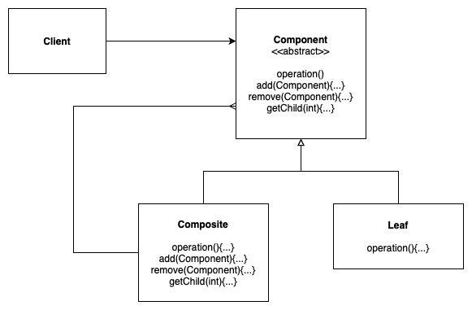
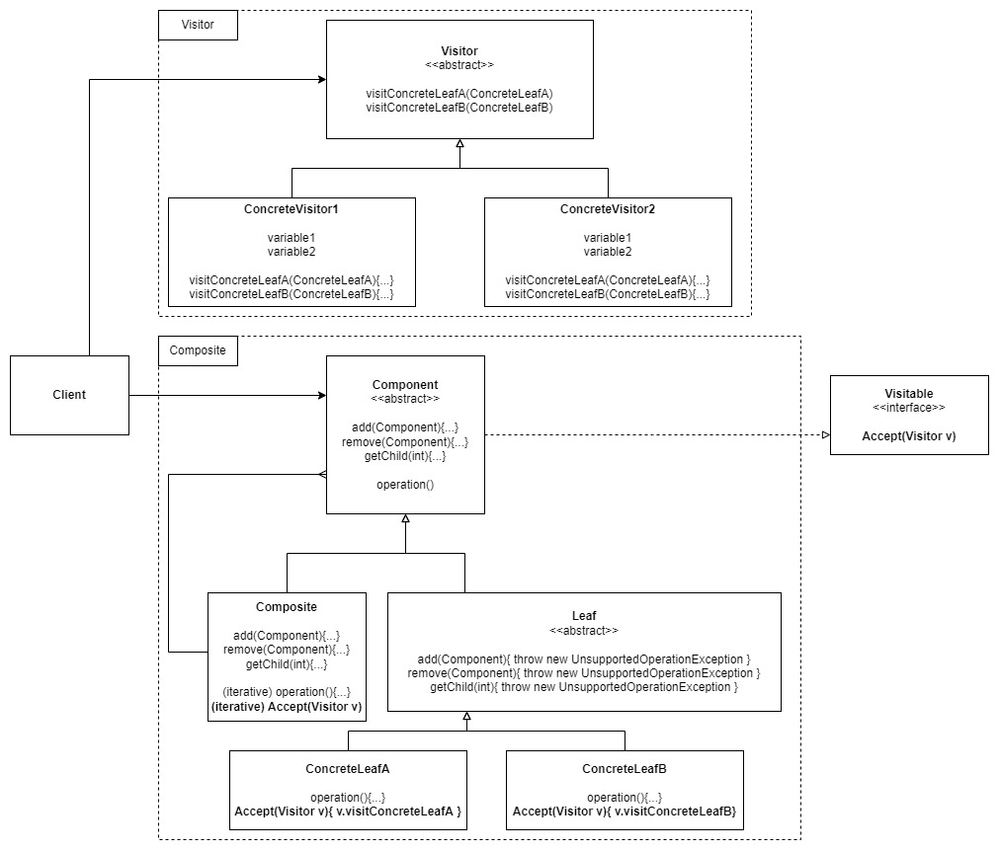
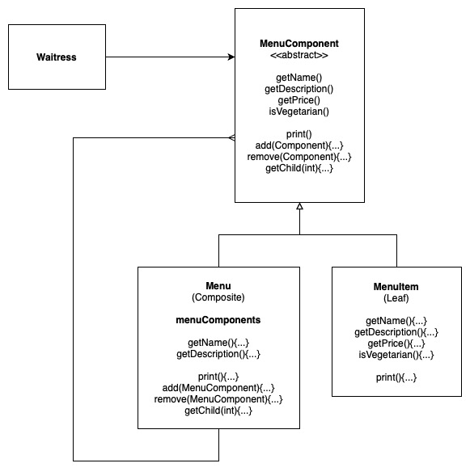
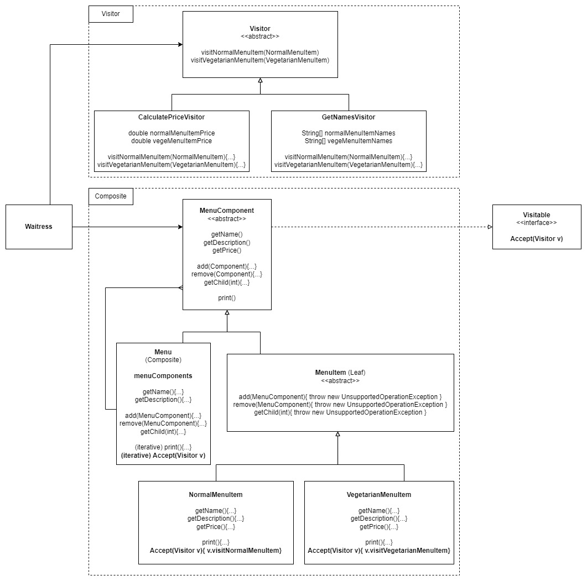

# Visitor Pattern

Represent operations to be performed on different types of object structure. Visitors define new operation without changing the classes of the elements on which it operates.

Related Example: [Composite Pattern](https://github.com/asyrul21/designPatternsReference/tree/master/src/CompositePattern)

## Design Solution (Composite Visitor)

### The Composite Pattern Solution:

We will refer to the exact example of the one found in Composite Pattern.

### The Visitor Pattern for Composite Solution:

## Example 1: The Merged Menu with Desserts, but there are two types of MenuItems

### The tree structure:

### Composite pattern example:

For this example we shall make a few modifications to the initial implementation of Composite Pattern Example 1:

1. We remove the `isVegetarian` property
2. `MenuItem` is now abstract, with Concrete elements of `NormalMenuItem` and `VegetarianMenuItem`
3. The Visitors visit each of these concrete menuItems, performing specific tasks. In our case, one visitor will compute their total price, and on will compile the names of each type of menuItems.

### Composite Visitor Pattern example:

## Other Examples

[Example in NodeJS](https://github.com/asyrul21/design-patterns-nodejs/tree/master/structural/composites)

